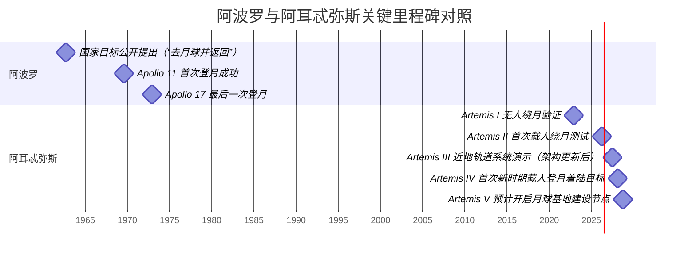
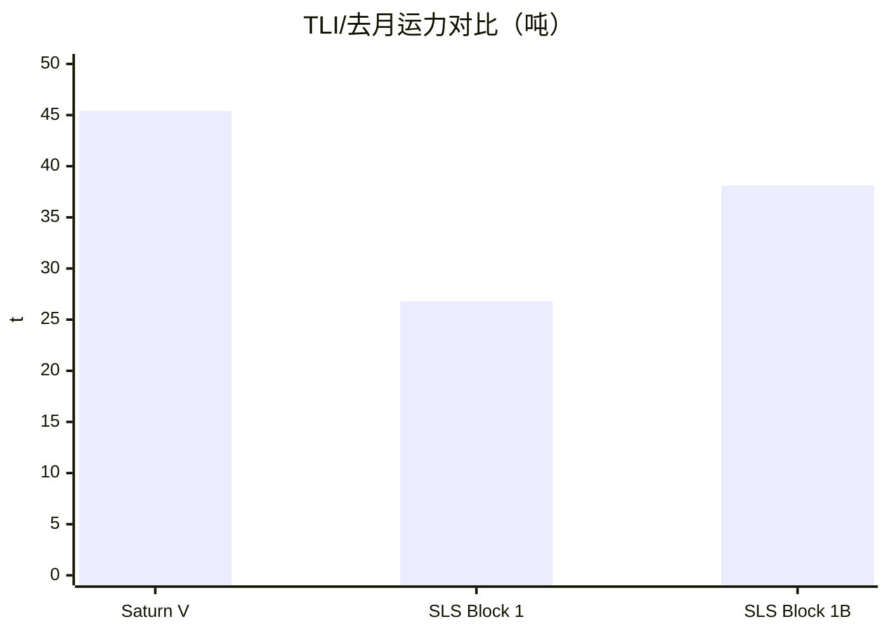

# 阿波罗与阿耳忒弥斯登月计划对比研究：从“一次性登月”到“可持续月球体系”

## 执行摘要

阿波罗登月计划的工程逻辑，可以概括为“为一个明确、可验证、时间受限的国家目标，打造一次性最短路径的端到端系统”：用一枚超重型火箭把完整登月体系一次送上天，在月球附近以“月球轨道交会对接”（LOR）完成“降—升—返”，并以强烈的集中式管理把复杂性压到可控。阿波罗的成功，既是技术胜利，也是冷战语境下的组织动员胜利；其总成本约为 1960 年代美元 254 亿（约合 1990 年美元 950 亿），体现了“用财力换时间、用集中换确定性”的策略。citeturn55view0turn0search12turn0search8

阿耳忒弥斯登月计划则在目标函数上发生结构性变化：不再把“第一次登月”视为终点，而是把月球当作通往更深空（尤其是火星）的“训练场与基础设施前哨”。citeturn63view0turn33view0turn54view0 这直接驱动其体系架构从“单次闭环”变为“系统之系统”：由entity["organization","NASA","us civil space agency"]牵头，结合商业月面着陆器（HLS）、近月轨道平台（Gateway）、商业月球货运与探测（CLPS）、新一代舱外服（xEVAS）等多条供应链，逐步建立可重复执行、可扩展、可国际共建的月球活动能力。citeturn54view0turn63view0turn64search1turn36search8

就“设计意义”而言，阿耳忒弥斯最关键的价值不在于复制阿波罗的脚印，而在于把登月从“壮举型项目”改写为“平台型产业与治理工程”：  
- **工程上**：从单火箭一次送齐，转向多航天器交会对接、多次补给与长期维护；轨道选择更加强调全球可达性、通信可见性与轨道稳定性（例如 NRHO）。citeturn33view0turn63view0  
- **组织上**：从以传统主承包商为核心的集中式项目，进一步转向固定价格、里程碑支付、风险分担的商业采购，并通过“洞察/监督”模型在创新速度与载人安全之间找平衡。citeturn63view0turn36search1  
- **战略上**：用《Artemis Accords》等机制把未来月球活动的透明、互操作、安全、资源利用等原则制度化，争取规则与伙伴网络的先手。citeturn64search0turn64search2turn54view0  

下文将按任务目标、时间线、运载与飞行器、航天员与训练、任务剖面与月面系统、导航通信航电、推进生命保障与安全、科学合作与预算文化及可持续性等维度，给出面向公众但尽量“工程可追溯”的对比分析；凡关键指标在权威英文资料中未给出者，将明确标注为“资料未注明”。citeturn55view0turn39view0turn54view0turn63view0

## 任务目标、时代语境与时间线

阿波罗的“第一性目标”是把人送上月球并安全返回地球。citeturn0search12turn47view0 在 1960 年代的冷战竞争中，这一目标同时承载了国家威望、技术优越性展示与制度动员能力的象征意义。citeturn55view0turn0search8 其任务设计因此高度偏向“可验证的单点成功”：登月、采样、部署少量科学装置、返回。citeturn50view0turn47view2

阿耳忒弥斯的目标则带有明显的“阶段性路线图”特征：在完成 SLS + Orion 的深空载人运输验证后，把月球南极区域作为长期科学与资源利用的重点，并逐步建立“持续存在”的工程与治理框架。citeturn54view0turn63view0turn53search0 2026 年 3 月entity["organization","NASA","us civil space agency"]发布的架构更新尤其关键：把原计划中的 2027 年登月着陆任务调整为近地轨道的系统演示，把“首次新时期载人登月着陆”目标明确转移到 2028 年的 Artemis IV，并提出其后“几乎每年一次任务”的节奏设想。citeturn54view0  

这种调整背后反映了阿耳忒弥斯的现实约束：多个关键要素（商业着陆器、舱外服、地面与火箭构型等）的成熟度不同步，系统集成风险不能用“强行压工期”简单消解。citeturn54view0turn63view0turn17view0

下面用时间线把两者的“工程节奏差异”直观化：阿波罗是“密集爬坡—迅速兑现—快速收束”；阿耳忒弥斯更像“长坡厚雪”的体系建设。citeturn55view0turn54view0

时间线中的阿耳忒弥斯后续节点来自entity["organization","NASA","us civil space agency"]对前五次任务“基本设想”的公开说明，属于官方计划而非确保日期；因此应读作“目标架构”，不是工程进度承诺。citeturn54view0turn63view0

## 运载火箭与飞行器架构

阿波罗的登月体系本质上是一个“单次发射的闭环机器”：entity["organization","NASA","us civil space agency"]的 Saturn V 把 CSM（指令/服务舱）与 LM（登月舱）送入地球停泊轨道；第三次点火完成 TLI；CSM 完成转位对接把 LM 从适配器中“抽出”；在月球近圆轨道释放 LM，LM 下降级着陆并成为上升级起飞平台；上升级回到月球轨道与 CSM 交会对接；最后由服务舱主发动机执行返航与制动，指令舱再入溅落。citeturn47view2turn50view0  

阿耳忒弥斯的载人“运输主干”仍然延续“重型火箭 + 乘员舱”的传统路线，但它把“着陆与月面生活”从主干中拆出来交给商业要素，并把长期驻留需要的通信、补给、能源与居住模块化：SLS/Orion 负责把人安全送到近月空间并带回；HLS 负责把人带到月面并返回近月轨道；Gateway 作为潜在的深空聚合点与科学平台；CLPS 作为常态化机器人月面投送通道。citeturn54view0turn63view0turn33view0turn64search1

image_group{"layout":"carousel","aspect_ratio":"16:9","query":["Saturn V launch Apollo program","NASA SLS rocket on launch pad 39B","Apollo Command Service Module diagram","Orion spacecraft with European Service Module"],"num_per_query":1}

### 运载火箭指标对比

下表把“把能量推到月球方向”的能力（TLI/去月运力）作为核心指标，因为它直接决定：一次发射能带多少人、多少货、能否携带共乘舱段。citeturn21view1turn43view0turn32view0  

| 火箭 | 总高 | 起飞质量 | 起飞推力 | 近地轨道运力 | TLI/去月运力 |
|---|---:|---:|---:|---:|---:|
| Saturn V | 85.95 m（仅箭体）/110.64 m（带飞船） | 2812.3 t | 33362 kN | 122.5 t | 45.4 t |
| SLS Block 1 | 98.1 m | 2608.2 t | 39144 kN | 资料未注明 | 26.8 t |
| SLS Block 1B | 111.6 m | 2721.6 t | 资料未注明（级别与 Block 1 接近） | 资料未注明 | 38.1 t |

数据来源：Saturn V 指标来自阿波罗时期官方资料页；SLS Block 1 指标来自 Artemis I “Fast Facts”；SLS Block 1B 指标来自官方 Block 1B 事实清单（NASA Facts）。citeturn21view1turn43view0turn32view0  

为了把差异“看成一张图”，可用下列柱状对比（TLI/去月运力，单位吨；越高表示一次发射送往月球方向的质量越大）：  

工程含义很直接：  
- **阿波罗**凭 Saturn V 的高 TLI 运力把“登月舱 + 返航舱 + 人 + 相当多的推进剂与冗余”一次打包。citeturn21view1turn47view2  
- **阿耳忒弥斯**用 SLS 把“人+深空返回系统”打包，而把“月面往返与驻留”拆到另一套系统（HLS/补给链）中，这在载荷能量上是“分段供能”的思路。citeturn54view0turn63view0  

### 载人飞行器与关键部件

阿波罗 CSM/LM 的质量分配体现了“推进剂占大头”的深空现实（尤其服务舱与登月舱下降级）。citeturn27view0turn20view0turn60view0 而阿耳忒弥斯的 Orion 以更大的再入热防护与更长任务冗余为约束，去月质量约 24 吨级别，同时引入欧洲服务舱推进与供电，并在系统层面预留与商业载具对接的能力。citeturn43view0turn42view0turn39view0  

| 系统 | 关键尺寸 | 典型质量 | 备注 |
|---|---|---|---|
| Apollo 指令舱（CM） | 高 3.23 m，直径 3.91 m | 发射/在轨含乘员≈5.90 t；溅落≈5.31 t | RCS 推进剂≈0.12 t |
| Apollo 服务舱（SM） | 高 7.37 m，直径 3.91 m | 装载≈24.95 t；干≈5.22 t | SPS 燃料≈7.15 t；SPS 氧化剂≈11.43 t；RCS 推进剂≈0.62 t |
| Apollo 登月舱（LM） | 高 6.99 m（带腿），直径 9.45 m | 装载含乘员≈14.74 t；干≈4.08 t | 下降级推进剂≈8.11 t；上升级推进剂≈2.35 t；RCS≈0.27 t |
| Orion 乘员舱 + 服务舱 | 高 7.92 m；加压容积≈19.6 m³ | 去月质量≈24.04 t；返回溅落质量≈8.26 t | 细分质量与推进剂装载：本组来源未注明 |
| Orion 欧洲服务舱推进剂系统 | 4×2000 L 推进剂箱；25 bar | 推进剂总容量≈9 t | 主发动机 25.7 kN；8×490 N + 24×220 N 姿控/备份 |

上述 Apollo CM/SM/LM 指标来自阿波罗时期各分系统概览页；Orion/SLS 指标来自 Artemis I 官方“Fast Facts”；欧洲服务舱推进来自entity["organization","European Space Agency","intergovernmental space agency"]公开技术页。citeturn24view0turn27view0turn20view0turn43view0turn42view0  

需要特别说明：阿耳忒弥斯的“商业 HLS 着陆器”在不同供应商方案下体量差异巨大（例如entity["company","SpaceX","us aerospace company"]的 Starship 变体与entity["company","Blue Origin","us aerospace company"]方案），公开权威资料对其“整器质量、月面载荷能力”等数字常随方案迭代而变化；在entity["organization","NASA Office of Inspector General","us government watchdog"] 2026 年审计报告中，可明确的几项是 Starship HLS 的高度约 171 英尺（≈52 m）以及需要在近地轨道完成推进剂补给的多构型思路，但具体“质量—性能”参数并未在该报告中给出，应视为资料未注明。citeturn63view0  

## 航天员画像、选拔训练与任务组织

阿波罗时代的航天员体系具有显著的“试飞员文化”：以高风险环境下的程序纪律、手控能力与故障处置为核心素养。Apollo 11 新闻资料在介绍主备乘组时，强调成员的飞行经历、军衔与此前任务训练，并明确“备份乘组不仅协助准备，还接受近乎完整训练，以便随时顶替”。citeturn50view0 这种组织方式与阿波罗的任务特点匹配：每次飞行间隔短、硬件改型快、程序频繁更新，需要乘组与地面团队形成高度同构的“任务语法”。citeturn47view0turn55view0  

阿耳忒弥斯的航天员与训练体系延续了entity["organization","NASA","us civil space agency"]长期建立的多来源宇航员选拔（军方、科学、工程等）与国际乘组合作。Artemis II 新闻资料（官方 Press Kit）给出的乘组履历显示：成员普遍具有长期entity["point_of_interest","International Space Station","low earth orbit"]任务经验、系统工程背景与跨机构训练经历，其中还包括entity["organization","Canadian Space Agency","canada national space agency"]航天员参与。citeturn39view0turn38search0  

更重要的差异在“训练重点”上：  
- 阿波罗训练要证明“人能把 LM 手控安全落下、再把上升级对接回 CSM”，因此交会、下降制导、应急返回是训练核心。citeturn50view0turn47view2  
- Artemis II 作为首次载人深空测试，其训练与任务设计强调“在仍可返航的窗口内完成系统验证”，例如在地球轨道阶段就要进行生命保障系统评估、通信与导航系统验证，以及一次手动近距离操作演示（以 ICPS 上面级作为目标），为未来与商业着陆器的交会对接积累操作经验。citeturn39view0turn52view2  

这种差异可以理解为：阿波罗训练的“终局动作”是月面着陆；阿耳忒弥斯训练的“终局动作”更像“把载人系统变成可反复调用的深空交通工具”，并把着陆动作分发到更大体系中。citeturn54view0turn63view0  

## 任务剖面、轨道与着陆与月面系统

### 从地球出发到月球附近

阿波罗的典型剖面强调“地球停泊轨道 + 第三级再点火 TLI + 自由返回备用轨道 + 月球近圆轨道作业”。在阿波罗任务描述资料中，TLI 由第三极发动机在地球停泊轨道再点火完成；并指出名义轨道具有“free return”属性——若无法进入月球轨道，航天器将自然回到地球。citeturn47view2 Apollo 11 新闻资料进一步给出：进入约 100 海里地球停泊轨道约两小时后执行 TLI；随后完成 CSM 与 LM 的转位对接与抽取；到月球后进行两次 LOI 把轨道从 60×170 海里调到接近 54×66 海里，并在此后准备下降。citeturn50view0  

Artemis II 则在“先验证、再远行”的逻辑下，把任务前半段留在地球附近：SLS 将 Orion 送入初始轨道后，上面级（ICPS）先后执行提高近地点与远地点的点火，最终把 Orion 放入一个用于系统检查的高椭圆轨道（官方给出的示例为约 44,525×115 statute miles），在这里完成生命保障、通信导航等关键检验；随后 Orion 以服务舱主发动机执行 TLI，把飞行器送上约 4 天的去月航程，并采用“绕月自由返回”让轨道力学成为“默认救生绳”。citeturn39view0turn52view2  

这种设计在工程上很“阿耳忒弥斯”：它把“承诺深空之前的检查窗口”制度化，等价于在系统工程里增加一道“飞行态集成测试”。阿波罗当然也有停泊轨道检查，但 Artemis II 更强调在高地球轨道阶段完成手动近距操作演示，以为未来与商业着陆器/深空设施交会对接做铺垫。citeturn39view0turn54view0  

### 近月轨道选择与着陆方式

阿波罗的“月球轨道交会对接”（LOR）把 CSM 留在低月轨，LM 下降并在返回后对接。Apollo 11 新闻资料中，LM 会先被下降发动机送入近月椭圆轨道（示例写到近月点约 50,000 英尺），再实施动力下降与着陆；上升级起飞后约 7 分 14 秒动力段进入 9×45 海里轨道，并用 RCS 完成交会序列。citeturn50view0  

阿耳忒弥斯的“长期体系”则把近月交通组织推向更稳定、更利于覆盖南极的轨道族。Gateway 关键论文把 NRHO 描述为 Gateway 计划运行的近月轨道，并强调其对全月面可达性、通信可见性、轨道稳定性与低维护成本的综合优势，同时指出 Gateway 目标在该轨道运行至少 15 年。citeturn33view0 与之对应，HLS 在近月轨道（NRHO 场景中常见）与 Orion/设施对接，再由两名航天员转移到着陆器执行月面任务的概念，在 entity["organization","NASA Office of Inspector General","us government watchdog"] 的 HLS 合同管理审计中有明确表述。citeturn63view0  

需要注意：2026 年 3 月的entity["organization","NASA","us civil space agency"]架构更新显示，Artemis III 将被设计为近地轨道的交会对接演示任务；首次实施载人登月着陆的目标任务转移到 2028 年 Artemis IV，并将“由 Orion 转移到商业着陆器再往返月面”的流程作为基本框架。citeturn54view0turn63view0 这意味着：至少在当前官方架构下，“Artemis 的登月”不再是一条单线，而是一套可插拔的运输接口——谁的着陆器准备好，谁就可能承担首次着陆。citeturn54view0turn63view0  

### 月面系统：着陆器、舱外服、栖居与移动

阿波罗的月面系统以 LM + 舱外服为核心，后期任务引入月球车（LRV）扩展活动半径。Apollo 11 新闻资料明确：在月面约两小时四十分钟的 EVA 中，航天员采集样品并部署早期科学实验套件（例如地震仪与激光反射器）。citeturn50view0 更系统化的 ALSEP 文档把 ALSEP 定义为一组可在航天员离开后持续工作的科学仪器组合，用于长期监测月球环境。citeturn48search2  

阿耳忒弥斯把“月面系统”扩展为一个组合体：  
- **舱外服**：entity["organization","NASA","us civil space agency"]选择entity["company","Axiom Space","us commercial space company"]承担首套 Artemis 月面行走舱外服服务任务单，合同基值约 2.285 亿美元，体现从“NASA 自研服装”转向“服务化采购”的路径。citeturn36search8  
- **栖居与基地概念**：entity["organization","NASA","us civil space agency"]对 Artemis Base Camp 的设想指出：初期任务中着陆系统可兼作短期住宿；未来将建设可容纳最多 4 名航天员、持续约一个月的固定栖居舱。citeturn34search3  
- **移动能力**：深空栖居与可持续月面存在研究将“地形车（LTV）、加压漫游车（PR）、月面栖居舱（SH）与能源系统、现场资源利用（ISRU）”视为基地核心要素之一，但公开材料多强调架构仍在权衡中，许多参数属于“未最终定版”。citeturn34search7  

与阿波罗相比，阿耳忒弥斯月面系统的最大变化是：把“住与行”从一次任务的附属品，提升为体系能力的主干之一，其关键约束从“能不能走两小时”变为“能不能把维护、补给、尘埃危害、长期健康风险控制在可持续范围内”。citeturn34search3turn34search7turn63view0  

## 导航制导通信与航电

阿波罗时代的导航制导，是“数字计算 + 惯性平台 + 光学测量 + 地面网”的混合体。Apollo 的制导与导航系统资料显示：导航设备包含望远镜与六分仪，用于测量恒星与地标夹角、校准惯性测量单元；并给出一个非常“60 年代但很硬核”的细节：六分仪视场约 1.8 度、放大倍率约 28，计算机存储约 38,912 个“words”，并分为可擦写与不可擦写存储区。citeturn58view2 另有系统图展示“光学—惯性—计算机—控制系统”的数据流，强调航天员能以半自动或手动方式操作，并可由地面遥测更新。citeturn58view1turn58view0  

阿耳忒弥斯的导航通信体系则建立在更强的全球网络与更高带宽能力之上。Artemis II Press Kit 明确：在高地球轨道阶段，Orion 会短暂飞出 GPS 与近地中继系统覆盖范围，以提前检验entity["point_of_interest","Deep Space Network","interplanetary antenna network"]（DSN）的深空通信与导航能力；并指出 Artemis 任务依赖entity["organization","NASA SCaN","space communications and navigation program"]旗下的近地网络与 DSN 形成覆盖全程的通信与跟踪服务。citeturn39view0 Press Kit 还提到 Artemis II 将测试激光通信：用红外光替代无线电传输数据，以更短波长实现更高数据通量。citeturn39view0  

从“航电哲学”看，这一变化可以总结为：  
- 阿波罗把“计算”做在飞船里，但把“信息”高度依赖地面网（例如中途修正、跟踪与故障分析）；  
- 阿耳忒弥斯依然强调地面网，但其通信、导航与计算能力更适合“多航天器交会 + 多供应商系统集成”，尤其当未来需要在近月轨道同时管理 Orion、HLS、Gateway、补给飞船与月面设备时，网络与时间触发以太网等“系统工程基础设施”本身就成了任务能力的一部分。citeturn35view0turn33view0turn54view0  

## 推进、生命保障与安全冗余

### 推进系统的“化学逻辑”与“体系逻辑”

阿波罗的推进是典型的“高可靠双组元”思路：服务舱装载质量约 55,000 磅，其中推进剂占比极高；SPS 燃料与氧化剂合计约 4.1 万磅级别，体现“用推进剂买机动能力”。citeturn27view0 登月舱同样是推进剂主导：下降级推进剂约 17,880 磅、上升级推进剂约 5,170 磅，下降级既是刹车发动机的燃料库也是月面起飞平台。citeturn20view0turn50view0  

阿耳忒弥斯的 Orion 推进由欧洲服务舱承担核心功能。entity["organization","European Space Agency","intergovernmental space agency"]公开资料给出：推进系统共有 33 台发动机（主发动机 + 8 台 490 N 级备份推进器 + 24 台 220 N 姿控发动机），推进剂由 4 个 2000 L 箱提供，总容量约 9 吨。citeturn42view0 这套系统不仅用于正常轨道机动，也被明确写入“发射中止后的接管”：当发射逃逸塔分离后若出现问题，服务舱可把乘员舱带离火箭并引导安全返回。citeturn42view0turn43view0  

真正的“体系级推进变化”发生在 HLS：entity["organization","NASA Office of Inspector General","us government watchdog"]审计报告指出，以 Starship HLS 为例，其方案需要“着陆器—补给油船—轨道储箱/仓”的多构型配合，在近地轨道完成推进剂补给后再前往近月空间。citeturn63view0 这意味着阿耳忒弥斯把“推进剂补给”从地面一次性装载，推向轨道补给与在轨流体管理——而这恰恰是可持续深空活动必须跨越的门槛之一。citeturn63view0turn33view0  

### 生命保障：从“满足任务”到“面向长期闭环”

阿波罗生命保障以满足任务为导向：舱内为氧气环境（示例要求约 5 psia），二氧化碳用氢氧化锂吸收罐去除，并在热控上提供主/备两套冷却回路（含散热器与蒸发冷却），体现“关键功能冗余而非闭环再生”的时代特征。citeturn60view0  

阿耳忒弥斯的载人深空舱（Orion）在概念上更接近“综合环境控制与生命保障系统（ECLSS）”，其任务是管理空气、水、废弃物、舱内参数与应急响应。citeturn61search0 就具体子技术而言，NTRS 技术材料指出“胺摆床（Amine Swingbed）”这类可再生吸附技术被作为 Orion 计划的二氧化碳与湿度去除基线方向之一，说明 Artemis 体系在向“更高闭环度、可重复飞行”积累关键技术资产。citeturn61search2  

在“返回与回收”方面，官方材料强调 Orion 以约 25,000 mph 级别的再入速度考核热防护、减速与降落伞系统，并通过海上回收流程验证载人深空任务的完整闭环。citeturn61search3turn43view0turn39view0  

### 安全、逃逸与风险管理

阿波罗的安全哲学可以用“多数故障有预案，少数灾难靠体系韧性”来概括：任务剖面本身嵌入“free return”作为大故障兜底；而 Apollo 13 事故更展示了 LOR 架构的一个“意外优点”——LM 作为自洽的生命保障单元，可在极端情况下充当救生艇。citeturn47view2turn55view0  

阿耳忒弥斯把“发射逃逸”能力制度化到 Orion 系统的组成部分中：Artemis I 官方材料指出逃逸系统可在毫秒级触发，在紧急情况下把乘员舱从火箭上拉离，并给出其强力逃逸发动机的加速能力描述。citeturn43view0 Artemis II 任务过程还把“在仍接近地球时完成系统验证”作为风险控制策略的一部分，例如先进入稳定高地球轨道再批准 TLI。citeturn39view0turn52view2  

但阿耳忒弥斯面临的新型风险来自“系统之系统”的集成：entity["organization","NASA Office of Inspector General","us government watchdog"]明确指出，HLS 属于关键路径；即便合同成本总体受控，供应商进度延误与技术/集成挑战仍可能影响着陆节点，并且 NASA 当前并不具备在深空或月面救援被困乘组的能力——这使得“预防性验证与冗余设计”比阿波罗时代更重要。citeturn63view0  

在地面与火箭基础设施上，风险同样会反向塑造架构：例如entity["organization","NASA Office of Inspector General","us government watchdog"]对 SLS Mobile Launcher 2 的审计显示其成本与进度压力巨大；而 2026 年 3 月官方架构更新直接宣布不再计划使用 EUS 与 ML2，并考虑替换第二级方案，反映“工程现实会逼迫体系减复杂”。citeturn17view0turn54view0turn32view0  

## 科学目标、合作伙伴、经费风险与长期可持续

### 科学目标与载荷：从“拿到样品”到“把月球当实验场”

阿波罗的科学回报最直观的是样品与现场实验。Apollo 11 新闻资料明确描述了：采集地质样品并部署地震实验与激光反射器等装置，使数据能够在任务后长期回传。citeturn50view0 而 ALSEP 文档把“长期监测”系统化，形成后续多次任务的标准化科学负载框架。citeturn48search2  

阿耳忒弥斯的科学目标在任务层面更“分布式”：  
- 近月轨道平台 Gateway 被定位为深空科学利用平台，论文指出已有 3 个科学载荷选择用于研究太阳与宇宙辐射，并计划在 NRHO 运行至少 15 年。citeturn33view0  
- 月面科学与技术试验被拆分到 CLPS：官方说明 CLPS 通过快速采购商业月面投送服务，把科学与技术载荷送到月球，既支持产业成长，也为未来载人任务提供数据与经验。citeturn64search1turn64search8  
- Artemis Base Camp 与南极区域探索把“挥发物/水冰、资源利用、长期生存”推到科学与工程的共同前沿。citeturn34search3turn54view0  

### 国际与商业伙伴：从“国家队”到“联盟与市场”

阿波罗虽有国际科学合作愿景，但工程主干基本由美国国内体系完成；其政治驱动与成本动员本质上属于国家项目。citeturn55view0turn0search12  

阿耳忒弥斯则把“合作”写进系统结构本身：  
- Orion 服务舱由entity["organization","European Space Agency","intergovernmental space agency"]提供并由entity["company","Airbus","european aerospace company"]主承制（Artemis II Press Kit 列出涉及多个欧洲国家的供应链）。citeturn39view0  
- Gateway 由多国机构共同治理：论文指出 MOUs 已与entity["organization","Canadian Space Agency","canada national space agency"]、entity["organization","European Space Agency","intergovernmental space agency"]、entity["organization","JAXA","japan space agency"]完成，并说明除entity["organization","Roscosmos","russia space agency"]外，ISS 合作伙伴基本都参与 Gateway。citeturn33view0  
- Gateway 的 HALO 模块由entity["company","Northrop Grumman","us aerospace company"]承建，其事实清单给出：HALO 直径约 3.0 m，可在 Orion 对接状态下支持最多 4 名乘员最多 30 天，并采用时间触发以太网等航电网络方案；同时列出entity["organization","European Space Agency","intergovernmental space agency"]通信载荷、entity["organization","JAXA","japan space agency"]电池等合作分工。citeturn35view0  
- 加拿大的 Canadarm3 作为 Gateway 关键外部机器人系统，其公开数据表给出长度约 8.5 m、质量估计约 1076 kg。citeturn34search2  

更宏观的“政治—治理伙伴网络”，体现在《Artemis Accords》：entity["organization","NASA","us civil space agency"]页面给出截至 2026-01-26，随着entity["country","Oman","middle east country"]加入，签署国达 61 个，并强调其原则旨在支持安全与可持续的太空探索。citeturn64search0turn64search2  

### 预算、进度风险与政治驱动

阿波罗的成本与政治动员在 NASA 历史研究中有清晰量化：总成本约 254 亿美元（1960 年代币值），被评价为美国技术与管理能力的集中展示。citeturn55view0  

阿耳忒弥斯的资金结构更分散，也更依赖长期国会拨款与商业合同执行。以entity["organization","NASA","us civil space agency"] FY2027 预算请求为例（单位：百万美元），探索领域中与登月直接相关的条目包括：  

| FY2027 预算请求条目 | 金额（百万美元） |
|---|---:|
| Moon and Mars Transportation System | 4,219.1 |
| Orion Program（合计） | 1,221.8 |
| Space Launch System | 1,495.3 |
| Exploration Ground Systems | 757.9 |
| Human Landing System（合计） | 2,277.2 |
| xEVA and Human Surface Mobility | 830.3 |

上述数字来自 FY2027 预算请求摘要页（Exploration 分项）。citeturn31view0  

在 HLS 这一关键路径上，entity["organization","NASA Office of Inspector General","us government watchdog"]指出：自 2019 年 HLS 项目启动以来 NASA 已为 HLS 发展承诺/支出（obligated）约 69 亿美元，并估计到 2030 财年累计将达 183 亿美元；同时明确“SpaceX 着陆器不可能在 2027-06 前具备月面任务就绪”，NASA 正评估加速方案以满足 2028 着陆目标，但可行性与成本影响尚不确定。citeturn63view0  

政治驱动方面，entity["organization","NASA","us civil space agency"]在 2026 年 3 月的架构更新中直接使用“实现国家目标、保持美国在探索与发现中的优势”等表述，说明阿耳忒弥斯依然承载地缘政治与国家战略叙事，只是表达方式从冷战“竞速”转向“联盟 + 规则 + 产业生态”。citeturn54view0turn64search0  

### 公共感知与文化影响

阿波罗在大众文化中的高峰来自“首次登月”的全球同步观看与叙事凝聚。NASA 历史研究记录 Apollo 11 引发的全球狂热反应、巡回访问与“人类共同成功”的象征效应，同时也指出后续任务虽科学收益继续增长，但公众兴奋度难以重复“首次”。citeturn55view0  

阿耳忒弥斯的公众叙事更强调“包容性与可持续”，并通过商业合作与国际伙伴扩大社会参与面。例如在 HLS 合同授予新闻稿中，entity["organization","NASA","us civil space agency"]将其描述为把人类推向可持续月球探索、并在价值层面关联到“女性平等”等社会叙事。citeturn36search1 这与阿波罗时代“国家荣耀/技术竞赛”的单一叙事形成对照。citeturn0search12turn55view0  

### 关键差异与对未来探索的含义总表

下表把“差异”直接翻译成“对未来更深空探索的含义”（尤其面向可持续与火星路径）：citeturn55view0turn54view0turn63view0turn33view0turn64search1  

| 维度 | 阿波罗 | 阿耳忒弥斯 | 对未来探索的含义 |
|---|---|---|---|
| 核心目标 | 证明“能登月并返回” | 建立“可持续月球存在”并为火星铺路 | 评价标准从“首次成功”转为“可重复、可扩展、可维护” |
| 架构形态 | 单次发射闭环：CSM+LM 一体化登月链路 | 系统之系统：SLS/Orion + 商业HLS + Gateway/CLPS + 新舱外服服务 | 复杂性从火箭内部转移到接口与集成；接口标准与运维能力成为核心资产 |
| 轨道与交通组织 | 低月轨作业、LOR 成熟且紧凑 | NRHO 等更稳定轨道族 + 交会对接网络化 | 更适合覆盖南极与长期通信，但需要更强自主导航、通信中继与对接能力 |
| 推进与补给 | 地面一次性装载为主 | 引入在轨推进剂管理与多次补给（HLS典型） | 为火星任务必需的“轨道补给/流体管理/长期储存”提前踩坑 |
| 安全哲学 | 轨道力学兜底（free return）+ 任务级冗余（LM可成救生艇） | 逃逸系统制度化 + 飞行态集成测试窗口 + 多供应商风险管理 | 随系统耦合增强，风险从“单飞船故障”转向“跨系统接口与成熟度不同步” |
| 科学模式 | 样品返回 + 现场长期仪器（ALSEP） | 基地化科学 + 轨道平台科学 + CLPS 常态化机器人投送 | 科学从“少数大任务”转向“高频迭代”，数据与试验更接近工程节奏 |
| 合作与治理 | 以美国国内体系为主 | 国际模块化共建 + Artemis Accords 规则网络 | 规则与伙伴网络将决定未来资源利用与冲突避免的“操作空间” |
| 预算与进度 | 高峰期集中投入，明确时间截止 | 长期投入、预算结构分散；关键路径受商业与基础设施进度影响 | 可持续探索需要可预测的长期资金与稳定的工业产能，而不仅是一次性冲刺 |

结论可以用一句话收束：**阿波罗解决的是“人类第一次如何到达月球”；阿耳忒弥斯更像在回答“人类如何把月球变成一个可反复抵达、可长期工作的‘第二前沿’”**——而答案的关键不再只是一枚更强的火箭，而是一整套可长期运转的交通、能源、通信、补给、居住与治理系统。citeturn55view0turn54view0turn63view0turn33view0turn64search0